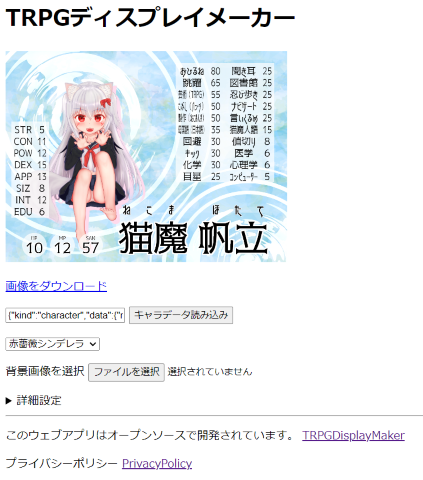
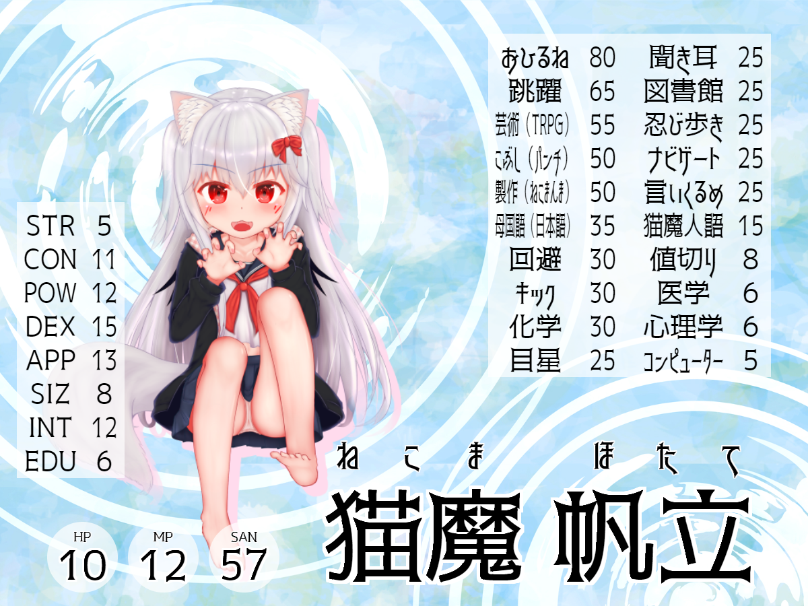

# TRPGDisplayMaker

上のような、TRPGのディスプレイ画像を作成するためのWebアプリです。

## 使い方
[GithubPages](https://hhotatea.github.io/TRPGDisplayMaker/)で動作を確認できます。
1. ココフォリアへ出力可能な形式のJson形式の[キャラクターデータ](https://docs.ccfolia.com/developer-api/clipboard-api)を準備する。
2. Webアプリ内のTextBoxにJsonを張り付ける。
3. `キャラクターデータ読み込み`ボタンを押す。
4. Canvas内の要素を調整。
5. `画像をダウンロード`ボタンから、出力物をダウンロードする。

## 開発者の方へ
リポジトリ作者の @HhotateA はWeb開発初心者で、これがJavascriptを使った初めての制作物です。
なにか不手際や改良点がありましたら、コミットでプロジェクトに参加してください。

## フォントを追加する手順
1. `releases/fonts`内にフォルダを作成し、フォントを配置する。
2. `releases/scripts/main.js`の27行目に`loadFont(ユニークなID,表示するフォント名,フォントのパス)`の行を追加する。
3. 通常通りコミットし、RPを作成する。

## ライセンス
例外として、

- `releases/font`フォルダ以下に含まれる各フォント
- `releases/sample`フォルダ以下の画像

の2つに関しては個別のライセンスが適応されます。

それ以外の、本プロジェクトに含まれる全ファイルおよびWebアプリは[MITライセンス](LICENSE.md)の元で提供されており、プロジェクト参加者による改変や再配布が自由に可能です。

またWebアプリを用いて出力した画像に関しては、このライセンスは適応せず出力者が自由に使用することができます。
（この場合でも、フォントや画像のライセンスは相変わらず適応されることに注意してください。）

本プロジェクトまたはWebアプリの出力物を使用する場合、以下のクレジットを入れていただければ幸いですが必須ではありません。  
「"TRPGDisplayMaker" by.@HhotateA_xR」

# 出力サンプル
初期設定では1200×900の解像度で出力されます。
